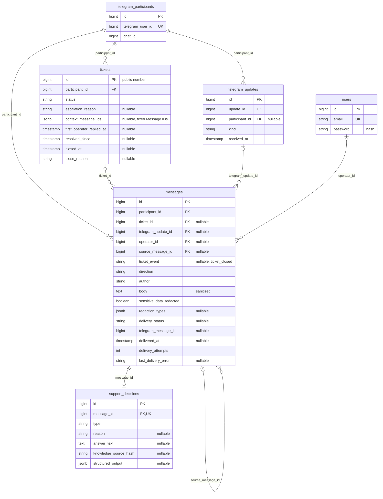

# Поддержка акции «Вкусная осень»

MVP на PHP 8.4, Laravel 13, PostgreSQL 17, Livewire 4 и Tailwind 4. Telegram принимает private text updates; один LLM request на попытку возвращает structured decision с ответом и evidence по единственному источнику [правил](docs/assignment/promo-rules.md). PHP выполняет deterministic validation структуры, decision/reason, rule IDs и цитат, без отдельного LLM verifier. Максимум — 3 provider attempts; invalid result, permanent failure и exhausted retries приводят к safe escalation. Персональные и неизвестные вопросы передаются оператору. Данные акции вымышлены; интеграции с чеками, аккаунтами и доставкой призов нет.

## Запуск с нуля

Нужны Docker с Compose и доступ к Telegram/LLM API. Host PHP, Node и PostgreSQL для запуска не требуются.

```bash
cp .env.example .env
docker run --rm php:8.4-cli-alpine php -r 'echo "base64:".base64_encode(random_bytes(32)).PHP_EOL;'
```

Сохраните выведенное значение как `APP_KEY` в `.env` один раз. Задайте собственные `OPERATOR_EMAIL`, `OPERATOR_PASSWORD`, `DB_PASSWORD`, `TELEGRAM_BOT_TOKEN`, случайный непустой `TELEGRAM_WEBHOOK_SECRET`, `LLM_MODEL`, `LLM_API_KEY` и OpenAI-compatible `LLM_ENDPOINT`. Не коммитьте `.env` и не меняйте `APP_KEY` при rebuild/restart: он общий для HTTP и workers и используется для шифрования session cookies. В образ ключ не записывается. Тестовый ключ из test configuration предназначен только для изолированной БД.

```bash
docker compose up --build -d --wait
```

Compose ожидает PostgreSQL, применяет migrations, создаёт оператора и запускает Nginx + PHP-FPM в app container. Затем стартуют существующие workers `ai,default`, `telegram` и `maintenance`; queue/cache/session используют PostgreSQL. `public/hot` исключён из Docker build context: образ использует собранные assets из frontend stage. Приложение доступно на loopback-порту 8000 (`APP_PORT` позволяет выбрать другой), панель — `/operator`, health — `/up`. `/up` подтверждает загрузку Laravel, а не доступность внешних API.

Повторный seed с тем же email не создаёт дубль и не меняет пароль существующего оператора. Пароль хранится как hash. Self-registration, роли и UI смены пароля отсутствуют; bootstrap не является механизмом ротации пароля. При обновлении исходников повторите `docker compose up --build -d --wait`, чтобы обновить также workers. `docker compose down` сохраняет данные volume; `down -v` удаляет их.

## HTTPS и webhook

До публичного доступа укажите `APP_URL=https://<ваш-домен>` и `SESSION_SECURE_COOKIE=true`, затем пересоздайте контейнеры. Compose принудительно использует `APP_ENV=production`, `APP_DEBUG=false`; `artisan serve` не используется. Host port привязан к `127.0.0.1`, FPM слушает только внутри app container. HTTPS завершается на локальном TLS proxy; Nginx принимает от него `X-Forwarded-Proto: https`. Не публикуйте backend port напрямую в интернет и не передавайте этот заголовок от недоверенного клиента.

Для пилота можно запустить `ngrok http 8000`, взять его HTTPS URL и зарегистрировать webhook через Telegram `setWebhook`. Передайте JSON с `url=https://<ваш-домен>/telegram/webhook` и `secret_token`, совпадающим с `TELEGRAM_WEBHOOK_SECRET`. Не вставляйте токены в README, shell history или отчёт. `getWebhookInfo` показывает pending updates и last error. После смены ngrok URL обновите `APP_URL` и webhook URL.

Webhook требует заголовок `X-Telegram-Bot-Api-Secret-Token`; неверный/пустой secret даёт 403 до сохранения данных. Валидный update получает 200 после persistence, LLM работает в очереди. Повтор update — успешный no-op. Group updates, служебные события и legacy inline callbacks игнорируются. На неподдерживаемое non-text сообщение в private chat, включая фото с подписью и документы, бот просит прислать вопрос и текст подписи отдельным текстовым сообщением. Содержимое, подпись и file metadata не сохраняются и не передаются LLM; создаются только update metadata и уведомление в существующей очереди доставки. Уведомление ограничено одним в минуту на участника и не создаёт ticket; при active ticket новое non-text сообщение также возвращает resolved в open, в историю добавляется только уведомление. Если curl работает, проверьте фактический URL и secret зарегистрированного webhook, pending updates и workers — наличие active ticket намеренно отключает обычный AI-routing.

Ngrok — пилотный HTTPS ingress, не постоянный hosting. Для длительного публичного запуска ещё нужны стабильный домен/TLS proxy, резервные копии PostgreSQL с проверкой восстановления, хранение секретов, мониторинг health/queues/failed jobs, ротация логов и политика хранения переписки. Эти эксплуатационные механизмы не реализованы в MVP.

## Поведение обращений и доставки

У участника не более одного active ticket (`open` или `resolved`). Новые входящие прикрепляются к нему без AI-routing. После terminal `closed` новый вопрос снова проходит обычную классификацию. Если active ticket появился во время обработки более раннего вопроса, общий lifecycle прикрепляет поздний input, подавляет устаревший AI-ответ и возвращает `resolved` в `open`.

Оператор может вести последовательную многошаговую переписку. «Отправить ответ» сохраняет сообщение для доставки и оставляет `open`; успешная delivery не решает ticket и не запускает auto-close. Отдельное действие «Отметить решённым» переводит `open` в `resolved` и атомарно создаёт delayed auto-close через `TICKET_AUTO_CLOSE_HOURS` (по умолчанию 24), независимо от черновика и доставки ответа.

Новое сообщение участника, включая late AI attach, или новый ответ оператора возвращает `resolved` в `open` и очищает `resolved_since`. Auto-close работает только для `resolved`: под row lock проверяет status, точное `resolved_since` и истечение срока. Timestamp хранится с микросекундами; stale job после reopen, нового решения или закрытия — no-op. Delivery и retry существующего ответа не меняют lifecycle.

Feedback-кнопки и ReplyKeyboardMarkup отсутствуют; тексты «Проблема решена» / «Не решило» обрабатываются как обычные сообщения участника. Оператор закрывает `open` или `resolved` вручную с `operator_closed`; автоматическое закрытие `resolved` фиксирует `auto_closed`. Оба способа сохраняют уже созданные operator replies для доставки, в том числе pending/failed. Устаревшие bot/system сообщения закрытого ticket отменяются; отдельное системное уведомление «Обращение №N закрыто оператором/автоматически» доставляется участнику и сохраняется в истории. `closed` terminal. Исторический `user_confirmed` доступен для просмотра.

`/start` представляет поддержку акции «Вкусная осень» и предлагает просто написать текстовый вопрос без поиска кнопки «Создать обращение». Бот объясняет ответ по правилам и автоматическую передачу проверки конкретного чека, приза или ситуации оператору, даёт три примера вопросов, предупреждает не отправлять номера банковских карт, CVV/CVC, пароли и SMS/OTP-коды. Фото/документы пока не обрабатываются: вопрос нужно описать текстом. Команда не создаёт ticket и не запускает AI.

Каждое исходящее Telegram сообщение, включая onboarding на `/start`, ответы бота, системные уведомления и operator replies, содержит `ReplyKeyboardRemove` (`reply_markup={"remove_keyboard": true}`). При ближайшей успешной доставке Telegram-клиент удаляет сохранённую старую клавиатуру. Отдельные сообщения для удаления, новые поля и специальные lifecycle-команды не создаются.

Пока предыдущий operator reply имеет `pending` или `failed`, создать следующий нельзя. Для pending доступны ожидание отправки и явная отмена; для failed — «Повторить» и «Отменить». Retry использует тот же record; после `sent` или явной cancellation можно отправить следующий ответ. Ручное закрытие не требует отмены сообщения, а retry/cancel ранее созданного ответа доступны также в closed ticket. Если Telegram HTTP уже начался до закрытия, результат доставки сохраняется, ticket остаётся closed без нового таймера. Telegram timeout после фактического приёма может привести к повторной доставке: exactly-once Telegram не гарантируется.

При обновлении существующей БД остановите приём webhook и workers, примените миграции новым кодом (`php artisan migrate --force --no-interaction`), затем перезапустите процессы на обновлённых образах. Текущая схема использует `open/resolved/closed`, `resolved_since` с микросекундами и поля контекста/системных событий; ранее созданные operator replies сохраняются для доставки. Применённые миграции не переписываются.

## Безопасность и ограничения AI

[Единственный prompt](resources/prompts/support-system.md) задаёт результат `decision/reason/answer/evidence`. Модель одновременно понимает вопрос, выбирает решение, формирует конкретный русский answer и цитаты из правил. Provider получает system instructions + правила + trusted московское время; sanitized participant text передаётся только в user role.

PHP проверяет JSON/schema, допустимые пары decision/reason, наличие rule ID и принадлежность непустой quote указанному пункту. `answer`/`mixed` требуют answer и evidence; `escalate` требует null answer и пустой evidence; `refuse/prompt_injection` допускает только безопасное «Я не могу выполнить этот запрос.» без фактов акции. Валидный answer сохраняется и отправляется как текст пользователя, без подмены полным правилом. Проверка реальности цитаты не доказывает правильность всех утверждений free-form answer; отдельного LLM verifier нет.

На попытку выполняется один LLM HTTP request с `LLM_TIMEOUT`. Штатная queue повторяет только transient errors, максимум три provider attempts на сообщение; даже `LLM_MAX_ATTEMPTS` выше трёх ограничивается тремя. Вложенного HTTP retry нет. Invalid result или permanent provider error сразу использует существующую safe escalation; после трёх transient failures применяется тот же fallback. Participant rate limits считают входящие запросы.

По умолчанию `LLM_TIMEOUT=120`, timeout AI job — 130 секунд, AI worker/listener — 150 секунд, `DB_QUEUE_RETRY_AFTER=180`. Reservation превышает execution timeout, чтобы долгий запрос не забрал второй worker. При изменении `LLM_TIMEOUT` согласуйте эти лимиты; уже поставленные в очередь jobs сохраняют timeout, заданный при создании. Три запроса, исчерпавшие по 120 секунд, и backoff 5 + 15 секунд займут около 6 минут 20 секунд без учёта ожидания в очереди и обработки результата.

Mixed request даёт grounded часть и эскалацию остатка. Обычный off-topic тоже эскалируется по буквальному требованию задания; prompt injection даёт безопасный отказ. Mixed/off-topic и определения метрик — допущения для уточнения менеджером. Модель не имеет административных tools и не подтверждает персональное состояние акции.

Sanitizer до persistence маскирует card-like sequences (включая Unicode-тире), явно обозначенные CVV/CVC, SMS/OTP и пароли, включая `!`/`#` в начале. Номер из 13–19 цифр после явного маркера карты (`карта`, `card`, `card number`) скрывается независимо от проверки Luhn и группировки цифр; для чисел без маркера сохраняются проверки формы и Luhn. CVV/CVC из 3–4 цифр скрывается после соответствующего маркера или фразы «код на обратной стороне карты». Password value определяется разделителем/кавычками либо цифрой/password punctuation в первом token; также маскируется одно значение после `мой пароль` / `my password` перед концом строки, запятой или точкой с запятой, включая `qwerty`, `reset` и `secret.word`. Явные/quoted значения обрабатываются первыми, чтобы скрывать фразу целиком. Word whitelist отсутствует; неразмеченная многословная prose, обычные даты, суммы и `Password reset does not work` сохраняются. Однословная owned-фраза неоднозначна и консервативно считается секретом: возможно избыточное маскирование такой фразы. В DB/queue/UI/LLM идут только обработанный текст и типы redaction `payment_card`, `cvv`, `otp`, `password`; raw Telegram body не сохраняется. Телефон намеренно остаётся для идентификации аккаунта. Это узкие эвристики, а не универсальная DLP: неизвестные форматы могут остаться незамаскированными. `/start` предупреждает не присылать секреты. UI экранирует сообщения; application error paths используют технические IDs/коды без body, provider response и секретов; Nginx access log выключен.

Лимиты LLM per participant задаются `LLM_REQUESTS_PER_MINUTE`/`LLM_REQUESTS_PER_DAY`. Длинные автоматические ответы сокращаются до Telegram 4096 Unicode символов с пометкой; полный sanitized body остаётся в истории. Operator reply валидируется вместе с presentation overhead.

Основная история выбранного обращения строго ограничена его `ticket_id`: предыдущие и последующие tickets одного participant не смешиваются. Отдельный read-only блок «Контекст до обращения» читает конкретные Message IDs из `tickets.context_message_ids`, зафиксированные при создании ticket. Он включает sanitized participant text и уже доставленные ответы бота от закрытия предыдущего ticket до исходного сообщения эскалации включительно; для первого ticket — с начала диалога. `messages.source_message_id` связывает ответ бота с вопросом внутри этой границы, а `messages.ticket_event=ticket_closed` обозначает системное сообщение закрытия и нижнюю границу следующего контекста. Поздние ответы на старые вопросы и новые сообщения не расширяют сохранённый контекст. Старые сообщения не перепривязываются; исходное сообщение эскалации прикрепляется к созданному ticket по обычному flow. Для исторических закрытий без события применяется консервативная граница по `closed_at`; сообщения той же секунды могут быть исключены. Старые tickets без списка ID не получают ретроспективный контекст, а bot answers без source linkage в него не включаются.

Панель показывает границу «Обращение №N создано» по ticket и системное сообщение закрытия в его истории. Действия ответа и доставки относятся только к выбранному ticket. Очередь, основная история и контекст имеют независимую cursor pagination (20 tickets / 50 messages / 50 context messages). Даты создания и закрытия ticket и timestamps сообщений отображаются в `Europe/Moscow` с пометкой «МСК»; приложение и сохранённые timestamps остаются в UTC.

## Статистика

В панели показаны все сохранённые данные, независимо от текущего фильтра queue:

- `bot resolved` («Доставлено ответов по правилам без оператора»): число самостоятельных исходящих bot answers без ticket, для которых сохранены `sent` и ненулевой `delivered_at`. `refuse` с фиксированным безопасным текстом исключён, как и mixed, уведомления об эскалации и системные предупреждения. Метрика подтверждает delivery, а не решение проблемы участником. Отдельные счётчики подготовленных ответов и состояний `pending`, `failed`, `cancelled` также исключают refuse.
- `escalated`: число созданных tickets, включая закрытые. Follow-ups и retry не увеличивают его.
- Среднее время первого ответа: `AVG(first_operator_replied_at - created_at)` по tickets с первым успешно отправленным operator reply. Timestamp фиксируется вместе с `sent` по `delivered_at`; задержка доставки входит во время ответа. Обращения без отправленного ответа исключены, отменённые ответы оператора показаны отдельным счётчиком. UI показывает минуты.

Forward migration пересчитывает исторический `first_operator_replied_at` по минимальному `delivered_at` отправленных ответов оператора и сбрасывает его в `null`, если таких ответов нет. На время пересчёта ticket writes блокируются в transaction. Откат миграции сохраняет исправленные данные: исходные timestamps подготовки ответа восстановить нельзя.

Onboarding `/start` является системным сообщением и не увеличивает показатели ответов бота. Отдельная forward migration исправляет классификацию старых предупреждений, сохраняя их содержимое и delivery state.

Запросы изолированы в `OperatorDashboard::statistics()`, повторный просмотр не мутирует DB и не вызывает внешние API. Метрики пока не имеют date range/export, а агрегаты читают весь архив; индексы и pagination защищают очередь/историю, но не превращают статистику в analytics platform.

## PostgreSQL



Все domain tables также имеют `created_at`/`updated_at`. FK удаления: participant cascade для tickets/messages, participant set-null для updates; ticket/update/operator/source message set-null для messages; message cascade для decision. `context_message_ids` — JSONB со списком ссылок по ID, без отдельной таблицы и перепривязки Message; чтение проверяет participant_id. Unique `update_id` предотвращает повтор ingestion, unique `message_id` — повтор decision. Partial unique `tickets(participant_id) WHERE status IN ('open','resolved')` гарантирует один active ticket. Status strings валидируются PHP enums/lifecycle, отдельного SQL CHECK для каждого enum нет.

Индексы queue: `(created_at,id)`, `(status,created_at,id)`, partial active `(created_at,id)`; history участника: `(participant_id,created_at,id)`, ticket queries: `(ticket_id,created_at,id)`. Laravel также использует `migrations`, `jobs`, `failed_jobs`, `job_batches`, `cache`, `cache_locks`, `sessions`, `password_reset_tokens`; batches/reset UI не реализованы. В queue payload передаются IDs, raw body отсутствует. Полный runtime prompt в DB не сохраняется.

Транзакции ingestion и AI application блокируют participant → active ticket → message; operator reply и delivery — ticket → message. Database jobs записываются в ту же PostgreSQL transaction через `beforeCommit()`, поэтому rollback отменяет также job, а worker видит её после commit. Production HTTP к LLM/Telegram выполняется вне DB transaction. Successful delivery атомарно сохраняет `sent`, `delivered_at` и, для первого operator reply, `first_operator_replied_at`; ticket status и таймер не меняются. Только отдельное действие «Отметить решённым» атомарно сохраняет `resolved`, `resolved_since` и delayed auto-close. Manual/auto close атомарно сохраняет системное событие закрытия и его delivery job. Retries защищены DB checks и существующим database cache lock.

## Проверки и evaluation

Полный suite на отдельном PostgreSQL без production credentials:

```bash
docker compose -f compose.testing.yaml run --build --rm tests
```

Test project `tg-promo-tests` имеет отдельную БД `tg_promo_test` в tmpfs, без host ports. PHPUnit и `Tests\TestCase` не допускают refresh другой БД. Узкий smoke:

```bash
docker compose -f compose.testing.yaml run --rm tests php artisan test --compact tests/Feature/SupportSmokeTest.php
```

Smoke идёт от HTTP webhook через реальные database queue jobs и Livewire operator replies до явного решения, reopen, manual/auto close, уведомлений о закрытии и трёх метрик. LLM/Telegram в нём заменены HTTP fakes; отдельные concurrency tests используют независимые workers. Это не проверка реальной доставки в телефон. Регрессии покрывают два быстрых вопроса, поздний AI после operator reply, входящий между Telegram rejection/retry, постоянный LLM failure, утечки и false positives sanitizer, отдельный фиксированный контекст и изоляцию ticket history.

[Evaluation сдаваемой single-call версии: все 25 обращений](docs/evaluation.md) выполнен 04.10.2026: OpenRouter `qwen/qwen3.8-27b:free`, текущий prompt, `json_object`, LLM timeout 120 с. Итог: **24 PASS, 0 PARTIAL, 1 FAIL**. В №18 бот передал вопрос оператору, но ошибочно исключил чеки из розыгрыша 6 октября, не учитывая перенос незавершённой проверки по 8.1. №9 и №12 больше не содержат прежних ложных утверждений; №19 дал полный ответ. Прогон прошёл настоящий HTTP kernel/webhook, ingestion, отдельные database AI/Telegram workers, реальный LLM, validator, сохранение и delivery-клиент в отдельной PostgreSQL-БД. Подменён только внешний ответ Telegram sendMessage для синтетических чатов. Выполнены 33 LLM HTTP requests: 25 HTTP 200 и 8 HTTP 429, восстановленных штатными retries; пройдены 325/325 механических проверок. Временная БД удалена. Prompt, модель и AI-код для evaluation не менялись. Полная таблица с ожиданиями по исходным правилам и причинами оценок сохранена в отчёте. Старый two-call evaluation явно помечен там как historical / previous implementation; [первый прогон](docs/evaluation-initial.md) также сохранён отдельно как исторический. Это один прогон независимых вопросов, без оценки multi-turn и статистической повторяемости; проверка ID/цитат не гарантирует семантической правильности вывода.

Повторный offline evaluation через `support:evaluate` (требует реального LLM и test image, не отправляет Telegram и откатывает fixtures). Он проверяет parser/ingestion и AI worker, но подменяет dispatch queue, пропускает HTTP webhook и Telegram delivery и поэтому не воспроизводит полный финальный прогон выше:

```bash
docker compose -f compose.testing.yaml run --rm tests php artisan migrate --force --no-interaction
docker compose -f compose.testing.yaml run --rm --env-from-file /absolute/path/private-llm.env -v "$PWD/docs:/app/evaluation-output" tests php artisan support:evaluate --output=/app/evaluation-output/evaluation-candidate.md --no-interaction
```

Создайте private env file вне репозитория с `LLM_ENDPOINT`, `LLM_MODEL`, `LLM_API_KEY`, `LLM_CONNECT_TIMEOUT`, `LLM_TIMEOUT`, ограничьте permissions и удалите после прогона. Команда перезаписывает отчёт с отметкой «требует проверки»: вручную оцените все строки. Не запускайте её одновременно с tests/refresh на этой БД. Eval использует rollback transaction вокруг LLM только в offline test run; записи/Telegram jobs не уходят в production.

Для LM Studio из Docker используйте `LLM_ENDPOINT=http://host.docker.internal:1234/v1/chat/completions`, ID загруженной модели и `LLM_RESPONSE_FORMAT=json_schema`: локальный API может отклонять стандартный для приложения `json_object`. Одна схема `support_decision` требует `decision`, `reason`, `answer`, `evidence`; JSON и связи decision/reason/answer/evidence, ID и quote membership проверяются в PHP. Режим `text` также доступен, но не гарантирует JSON со стороны provider.

```bash
vendor/bin/pint --dirty --format agent
npm run build
openspec validate mvp-promo-support --strict
docker compose -f compose.testing.yaml down
```

Последние три локальные команды требуют установленных Composer dev dependencies, Node и OpenSpec CLI. Redis, отдельные retry systems, микросервисы и новые состояния ticket не добавлены.
