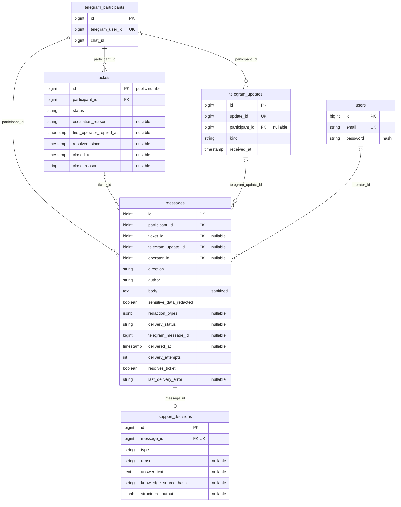

## Первый запуск и оператор

1. Скопируйте `.env.example` в `.env`.
2. Укажите `OPERATOR_EMAIL` и собственный непустой `OPERATOR_PASSWORD` в `.env` (либо передайте их через environment). Email в примере предназначен для разработки; готового пароля и development fallback нет. Не коммитьте `.env`.
3. Запустите `docker compose up` (после изменения исходников образа — `docker compose up --build`).

Compose проверяет обязательные credentials до запуска контейнеров. PostgreSQL сначала проходит healthcheck; app выполняет migrations, затем `DatabaseSeeder` создаёт оператора, после чего запускает HTTP server. Queue worker стартует только после healthcheck app. Если credentials отсутствуют, Compose завершается с понятной ошибкой; seeder дополнительно проверяет email и непустой пароль.

Повторный запуск с тем же email не создаёт дубль и не меняет пароль существующего пользователя. В PostgreSQL пароль сохраняется только как hash через `User` cast `hashed`. Bootstrap не является механизмом смены пароля. После startup войдите в `/operator` с указанными credentials; self-registration отсутствует.

## Тесты на PostgreSQL

Стандартная команда полного suite (нужен Docker Compose):

```bash
docker compose -f compose.testing.yaml run --build --rm tests
```

Команда собирает образ с Composer dev-зависимостями, запускает отдельный PostgreSQL 17, ожидает healthcheck и выполняет `php artisan test --compact`. Connection — `pgsql`, database — `tg_promo_test`; эти значения также печатаются перед suite. Test Compose имеет отдельный project `tg-promo-tests`, не публикует PostgreSQL port и хранит БД в `tmpfs`, без development volumes, credentials и операторского bootstrap. `.env` не попадает в image; runtime использует безопасный `.env.example`. Копировать production/development credentials для тестов не нужно.

`phpunit.xml` закрепляет PostgreSQL и имя test database; development `DB_DATABASE` и `DB_URL` не могут переопределить их. Дополнительная проверка в `Tests\TestCase` выполняется до database refresh и отклоняет другую БД или cached development configuration. Существующие `LazilyRefreshDatabase` tests применяют migrations к test DB, включая PostgreSQL partial unique index; обычный `php artisan test` также использует PostgreSQL, если test DB доступна на настроенном host.

Остановить временную тестовую БД после работы:

```bash
docker compose -f compose.testing.yaml down
```

<p align="center"><a href="https://laravel.com" target="_blank"></a></p>

<p align="center">
<a href="https://github.com/laravel/framework/actions"></a>
<a href="https://packagist.org/packages/laravel/framework"></a>
<a href="https://packagist.org/packages/laravel/framework"></a>
<a href="https://packagist.org/packages/laravel/framework"></a>
</p>

## About Laravel

Laravel is a web application framework with expressive, elegant syntax. We believe development must be an enjoyable and creative experience to be truly fulfilling. Laravel takes the pain out of development by easing common tasks used in many web projects, such as:

- [Simple, fast routing engine](https://laravel.com/docs/routing).
- [Powerful dependency injection container](https://laravel.com/docs/container).
- Multiple back-ends for [session](https://laravel.com/docs/session) and [cache](https://laravel.com/docs/cache) storage.
- Expressive, intuitive [database ORM](https://laravel.com/docs/eloquent).
- Database agnostic [schema migrations](https://laravel.com/docs/migrations).
- [Robust background job processing](https://laravel.com/docs/queues).
- [Real-time event broadcasting](https://laravel.com/docs/broadcasting).

Laravel is accessible, powerful, and provides tools required for large, robust applications.

## Learning Laravel

Laravel has the most extensive and thorough [documentation](https://laravel.com/docs) and video tutorial library of all modern web application frameworks, making it a breeze to get started with the framework.

In addition, [Laracasts](https://laracasts.com) contains thousands of video tutorials on a range of topics including Laravel, modern PHP, unit testing, and JavaScript. Boost your skills by digging into our comprehensive video library.

You can also watch bite-sized lessons with real-world projects on [Laravel Learn](https://laravel.com/learn), where you will be guided through building a Laravel application from scratch while learning PHP fundamentals.

## Agentic Development

Laravel's predictable structure and conventions make it ideal for AI coding agents like Claude Code, Cursor, and GitHub Copilot. Install [Laravel Boost](https://laravel.com/docs/ai) to supercharge your AI workflow:

```bash
composer require laravel/boost --dev

php artisan boost:install
```

Boost provides your agent 15+ tools and skills that help agents build Laravel applications while following best practices.

## Contributing

Thank you for considering contributing to the Laravel framework! The contribution guide can be found in the [Laravel documentation](https://laravel.com/docs/contributions).

## Code of Conduct

In order to ensure that the Laravel community is welcoming to all, please review and abide by the [Code of Conduct](https://laravel.com/docs/contributions#code-of-conduct).

## Security Vulnerabilities

If you discover a security vulnerability within Laravel, please send an e-mail to Taylor Otwell via [taylor@laravel.com](mailto:taylor@laravel.com). All security vulnerabilities will be promptly addressed.

## License

The Laravel framework is open-sourced software licensed under the [MIT license](https://opensource.org/licenses/MIT).

## Безопасность и ограничения AI

[Единственный prompt](resources/prompts/support-system.md) задаёт результат `decision/reason/answer/evidence`. Модель одновременно понимает вопрос, выбирает решение, формирует конкретный русский answer и цитаты из правил. Provider получает system instructions + правила + trusted московское время; sanitized participant text передаётся только в user role.

PHP проверяет JSON/schema, допустимые пары decision/reason, наличие rule ID и принадлежность непустой quote указанному пункту. `answer`/`mixed` требуют answer и evidence; `escalate` требует null answer и пустой evidence; `refuse/prompt_injection` допускает только безопасное «Я не могу выполнить этот запрос.» без фактов акции. Валидный answer сохраняется и отправляется как текст пользователя, без подмены полным правилом. Проверка реальности цитаты не доказывает правильность всех утверждений free-form answer; отдельного LLM verifier нет.

На попытку выполняется один LLM HTTP request с `LLM_TIMEOUT`. Штатная queue повторяет только transient errors, максимум три provider attempts на сообщение; даже `LLM_MAX_ATTEMPTS` выше трёх ограничивается тремя. Вложенного HTTP retry нет. Invalid result или permanent provider error сразу использует существующую safe escalation; после трёх transient failures применяется тот же fallback. Participant rate limits считают входящие запросы.

По умолчанию `LLM_TIMEOUT=120`, timeout AI job — 130 секунд, AI worker/listener — 150 секунд, `DB_QUEUE_RETRY_AFTER=180`. Reservation превышает execution timeout, чтобы долгий запрос не забрал второй worker. При изменении `LLM_TIMEOUT` согласуйте эти лимиты; уже поставленные в очередь jobs сохраняют timeout, заданный при создании. Три запроса, исчерпавшие по 120 секунд, и backoff 5 + 15 секунд займут около 6 минут 20 секунд без учёта ожидания в очереди и обработки результата.

Mixed request даёт grounded часть и эскалацию остатка. Обычный off-topic тоже эскалируется по буквальному требованию задания; prompt injection даёт безопасный отказ. Mixed/off-topic и определения метрик — допущения для уточнения менеджером. Модель не имеет административных tools и не подтверждает персональное состояние акции.

## Проверка ИИ и evaluation

[Evaluation всех 25 обращений](docs/evaluation.md) содержит результаты обработки и ручную оценку по правилам; [первый прогон](docs/evaluation-initial.md) сохраняет обнаруженные ошибки до уточнения prompt. Последний полный прогон 03.10.2026 выполнен на локальной `google/gemma-4-e4b` в LM Studio: 17 верно, 6 неверно, 2 спорно. В №9 модель ошибочно разрешила регистрацию чека 3 ноября, в №12 выдумала запрет на чек родственника; оба ответа прошли вторую LLM-проверку. Ещё пять cases завершились `llm_failure`. Эта конфигурация не продемонстрировала достаточного качества для пилота; отдельная проверка той же моделью не гарантирует семантическую корректность. Case 22 маскирован. Протокол: один isolated participant на вопрос, ProcessIncomingMessage выполняется штатным database Worker с tries/backoff/fallback; Telegram не вызывается, fixtures откатываются. Model result включает validation failures, infrastructure failure reason содержит HTTP/connection сбои; attempts записываются отдельно. Это отдельные cases с retry, не multi-turn conversation. Этот исторический прогон относится к прежнему pipeline со вторым verifier. Новый single-call pipeline проверен точечно на OpenRouter; сценарий №19 прошёл штатные webhook и workers, а последующий ручной повтор при LLM_TIMEOUT=120 завершился доставленным полным ответом без эскалации. Подробности и ограничения проверок сохранены в отчёте.

Повторный evaluation (требует реального LLM и test image, не отправляет Telegram и откатывает fixtures):

```bash
docker compose -f compose.testing.yaml run --rm tests php artisan migrate --force --no-interaction
docker compose -f compose.testing.yaml run --rm --env-from-file /absolute/path/private-llm.env -v "$PWD/docs:/app/evaluation-output" tests php artisan support:evaluate --output=/app/evaluation-output/evaluation.md --no-interaction
```

Создайте private env file вне репозитория с `LLM_ENDPOINT`, `LLM_MODEL`, `LLM_API_KEY`, `LLM_CONNECT_TIMEOUT`, `LLM_TIMEOUT`, ограничьте permissions и удалите после прогона. Команда перезаписывает отчёт с отметкой «требует проверки»: вручную оцените все строки. Не запускайте её одновременно с tests/refresh на этой БД. Eval использует rollback transaction вокруг LLM только в offline test run; записи/Telegram jobs не уходят в production.

Для LM Studio из Docker используйте `LLM_ENDPOINT=http://host.docker.internal:1234/v1/chat/completions`, ID загруженной модели и `LLM_RESPONSE_FORMAT=json_schema`: локальный API может отклонять стандартный для приложения `json_object`. Одна схема `support_decision` требует `decision`, `reason`, `answer`, `evidence`; JSON и связи decision/reason/answer/evidence, ID и quote membership проверяются в PHP. Режим `text` также доступен, но не гарантирует JSON со стороны provider.

## Поведение обращений и доставки

У участника не более одного active ticket (`open` или `resolved`). Новые входящие прикрепляются к нему без AI-routing. После terminal `closed` новый вопрос снова проходит обычную классификацию. Если active ticket появился во время обработки более раннего вопроса, общий lifecycle прикрепляет поздний input, подавляет устаревший AI-ответ и возвращает `resolved` в `open`.

Оператор может отправлять неограниченное число сообщений. Обычная «Отправить ответ» оставляет `open`. «Отправить и решить» сохраняет `resolves_ticket` в pending message; только успешная доставка этого сообщения переводит ticket в `resolved` и планирует закрытие через `TICKET_AUTO_CLOSE_HOURS` (по умолчанию 24).

Любое новое сообщение участника или новый ответ оператора возвращает `resolved` в `open`, очищает `resolved_since` и отменяет ещё не доставленное намерение решить ticket. Это действует также во время HTTP delivery, между ошибкой Telegram и retry и при late AI attach. Revision counters/snapshots отсутствуют. Старый auto-close проверяет status, `resolved_since` и ID ответа, поэтому не закрывает новый цикл, в том числе при одинаковых timestamps.

Кнопки «Проблема решена» / «Не решило» остаются обратной связью в истории и не закрывают ticket. Оператор может закрыть `open` или `resolved` вручную с `operator_closed`; недоставленные сообщения отменяются. `closed` не переоткрывается. Historical `user_confirmed` доступен для просмотра старых обращений.

Failed delivery одного сообщения не блокирует переписку или закрытие. UI позволяет повторить отправку того же record или отменить её. Если Telegram HTTP уже начался до закрытия, результат доставки сохраняется, но ticket остаётся closed без нового таймера. Временные ошибки LLM повторяются штатной queue с backoff; постоянные ошибки и невалидный JSON/schema/evidence используют прежний llm_failure fallback. AI pipeline этой доработкой не меняется. Telegram timeout после фактического приёма может привести к повторной доставке: exactly-once Telegram не гарантируется.

При обновлении существующей БД остановите приём webhook и workers, примените миграции новым кодом (`php artisan migrate --force --no-interaction`), затем перезапустите процессы. Forward migration переводит прежние waiting_for_user в open без автозакрытия, сохраняет историю и timestamps, обновляет active indexes и удаляет revision columns. Старые auto-close payload являются no-op; rollback не восстанавливает прежнее ожидание исторических обращений.

## Статистика

В панели показаны все сохранённые данные, независимо от текущего фильтра queue:

- `bot resolved` («Отправлено ботом без оператора»): число исходящих сообщений бота без ticket в состоянии `sent`. Это отправленные самостоятельные ответы и безопасные отказы, не подтверждение решения проблемы участником. Mixed, уведомления об эскалации и системные предупреждения исключены. Отдельно показаны подготовленные ответы бота и состояния `pending`, `failed`, `cancelled`.
- `escalated`: число созданных tickets, включая закрытые. Follow-ups и retry не увеличивают его.
- Среднее время первого ответа: `AVG(first_operator_replied_at - created_at)` по tickets с первым успешно отправленным operator reply. Timestamp фиксируется вместе с `sent` по `delivered_at`; задержка доставки входит во время ответа. Обращения без отправленного ответа исключены, отменённые ответы оператора показаны отдельным счётчиком. UI показывает минуты.

Forward migration пересчитывает исторический `first_operator_replied_at` по минимальному `delivered_at` отправленных ответов оператора и сбрасывает его в `null`, если таких ответов нет. На время пересчёта ticket writes блокируются в transaction. Откат миграции сохраняет исправленные данные: исходные timestamps подготовки ответа восстановить нельзя.

Предупреждение `/start` является системным сообщением и не увеличивает показатели ответов бота. Отдельная forward migration исправляет классификацию старых предупреждений, сохраняя их содержимое и delivery state.

Запросы изолированы в `OperatorDashboard::statistics()`, повторный просмотр не мутирует DB и не вызывает внешние API. Метрики пока не имеют date range/export, а агрегаты читают весь архив; индексы и pagination защищают очередь/историю, но не превращают статистику в analytics platform.

## PostgreSQL



Все domain tables также имеют `created_at`/`updated_at`. FK удаления: participant cascade для tickets/messages, participant set-null для updates; ticket/update/operator set-null для messages; message cascade для decision. Unique `update_id` предотвращает повтор ingestion, unique `message_id` — повтор decision. Partial unique `tickets(participant_id) WHERE status IN ('open','resolved')` гарантирует один active ticket. Status strings валидируются PHP enums/lifecycle, отдельного SQL CHECK для каждого enum нет.

Индексы queue: `(created_at,id)`, `(status,created_at,id)`, partial active `(created_at,id)`; history участника: `(participant_id,created_at,id)`, ticket queries: `(ticket_id,created_at,id)`. Индекс истории участника добавляется отдельной forward migration для существующих БД. Laravel также использует `migrations`, `jobs`, `failed_jobs`, `job_batches`, `cache`, `cache_locks`, `sessions`, `password_reset_tokens`; batches/reset UI не реализованы. В queue payload передаются IDs, raw body отсутствует. Полный runtime prompt в DB не сохраняется. `delivery_input_marker` удалён прежней forward migration. Новая lifecycle migration удаляет revision/snapshot, добавляет resolves_ticket=false и консервативно открывает прежние waiting tickets. Применённые migrations не переписываются.

Транзакции ingestion и AI application блокируют participant → active ticket → message; operator reply и delivery — ticket → message. Database jobs записываются в ту же PostgreSQL transaction через `beforeCommit()`, поэтому rollback отменяет также job, а worker видит её после commit. Production HTTP к LLM/Telegram выполняется вне DB transaction. Successful delivery атомарно сохраняет `sent` и переход/auto-close; retries защищены DB checks и существующим database cache lock.
